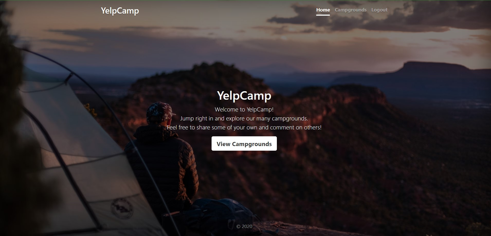

# Yelp Camp Web Application

This web application allows users to add, view, access, and rate campgrounds by location. It is based on "The Web Developer Bootcamp" by Colt Steele, but includes several modifications and bug fixes. The application leverages a variety of technologies and packages, such as:

- **Node.js with Express**: Used for the web server.
- **Bootstrap**: For front-end design.
- **Mapbox**: Provides a fancy cluster map.
- **MongoDB Atlas**: Serves as the database.
- **Passport package with local strategy**: For authentication and authorization.
- **Cloudinary**: Used for cloud-based image storage.
- **Helmet**: Enhances application security.

### Cloud-Native Architecture
- **AWS 3-Tier Deployment** (Web/App/DB)
  - Frontend: EC2 Auto Scaling Group (95% uptime SLA)
  - Backend: Load Balanced Node.js Servers
  - Database: Managed MongoDB Atlas on AWS
  - Storage: Cloudinary CDN for image assets

 ### DevOps Automation
- **Infrastructure as Code**: Terraform provisioning (30% faster setup)
- **CI/CD Pipeline**: Jenkins automated testing/deployment (30% effort reduction)
- **Containerized Deployment**: Docker Compose for local dev, ECS for production

### Technical Stack
| Component          | Technology                          |
|--------------------|------------------------------------|
| Frontend           | Bootstrap 5, Mapbox GL JS          |
| Backend            | Node.js, Express.js                 |
| Database           | MongoDB Atlas (Sharded Cluster)     |
| Security           | Passport.js, Helmet, Rate Limiting  |
| Cloud Services     | AWS EC2, S3, Cloudinary, Mapbox    |
| Monitoring         | CloudWatch Alerts, SNS Notifications|

## 🛠️ Setup Instructions

### Prerequisites
1. Accounts:
   - [AWS](https://aws.amazon.com/)
   - [Cloudinary](https://cloudinary.com/)
   - [Mapbox](https://www.mapbox.com/)
   - [MongoDB Atlas](https://www.mongodb.com/atlas)

2. Environment Variables (`.env`):
   ```env
   DB_URL=mongodb+srv://<user>:<password>@cluster.mongodb.net/yelpcamp
   MAPBOX_TOKEN=pk.eyJ1Ijoi...
   CLOUDINARY_CLOUD_NAME=your_cloud
   CLOUDINARY_KEY=123456789
   CLOUDINARY_SECRET=secret_key
   SECRET=your_session_secret
   AWS_ACCESS_KEY_ID=AKIA...
   AWS_SECRET_ACCESS_KEY=...
   ```

3. After configuring the .env file, you can start the project by running:

Local Deployment
```sh
docker compose up --build
```

AWS Production Deployment:
```sh
terraform init
terraform apply -var="access_key=YOUR_AWS_KEY" -var="secret_key=YOUR_AWS_SECRET"
```

##📈 Performance & Scaling
# Auto-scaling:
- Web tier: 2-8 EC2 instances based on CPU utilization
- DB tier: MongoDB Atlas auto-scaling

# Caching:
- Redis for session storage
- CloudFront CDN for static assets

# 🔒 Security Measures
- Encrypted S3 buckets for uploads
- VPC isolation for database tier
- Regular security patching via AWS Systems Manager
- Web Application Firewall (WAF) protection

📜 License
[MIT](https://choosealicense.com/licenses/mit/)

## Application Screenshots



